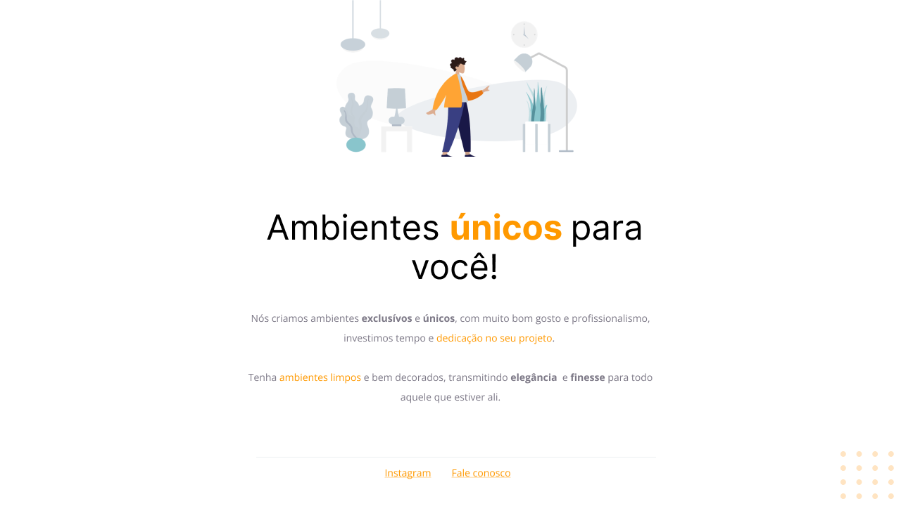

<h1 align="center"> Moveis </h1>

 

  

## 🚀 Tecnologias

Esse projeto foi desenvolvido com as seguintes tecnologias:

- HTML e CSS
- Git e GitHub 

## 💻 Descrição

A tela foi criada para divulgar uma loja fictícia de móveis. 

- [Acesse o projeto finalizado, online](https://andresa43.github.io/projeto_moveis_html_css/)

## 🔖 Layout

Você pode visualizar o layout do projeto através [DESSE LINK](https://www.figma.com/file/PgNMU5WXrgy8n77lp0XSmN/Explorer---Projeto-01-(Copy)?node-id=0%3A1&t=dwQ9WmTwcpQhYTuI-0). É necessário ter conta no [Figma](https://figma.com/) para acessá-lo.

## 📝 Licença

Esse projeto está sob a licença MIT.

---

Feito com ♥ Rocketseat 👋 [Acesse a comunidade!](https://discord.gg/rocketseat)
Figma
Figma: the collaborative interface design tool.
Build better products as a team. Design, prototype, and gather feedback all in one place with Figma.
Figma: the collaborative interface design tool.